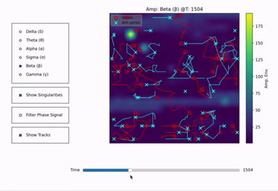

# LFP Oscillation & Phase Singularity Analyzer

## Core Idea

This project analyzes multi-frequency LFP oscillations and their corresponding phase fields to identify spatio-temporal characteristics relevant for future field evolution modeling.

The prototype processes 400 LFP channels (visualized as an upsampled 20x20 grid) to:
1.  Display **amplitude envelope evolution** for user-selected frequency bands.
2.  Detect and track **phase singularities** (vortices/anti-vortices) from either raw or band-filtered LFP phase.
3.  Provide an **interactive GUI** for dynamic exploration, including singularity trajectories.

## Demo
Randomly choiced 400 channels as an example
<!-- Replace with your GIF. Ensure 'analyzer_demo.gif' is in an 'assets' folder. -->

  

